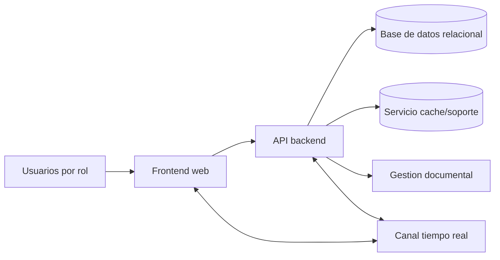
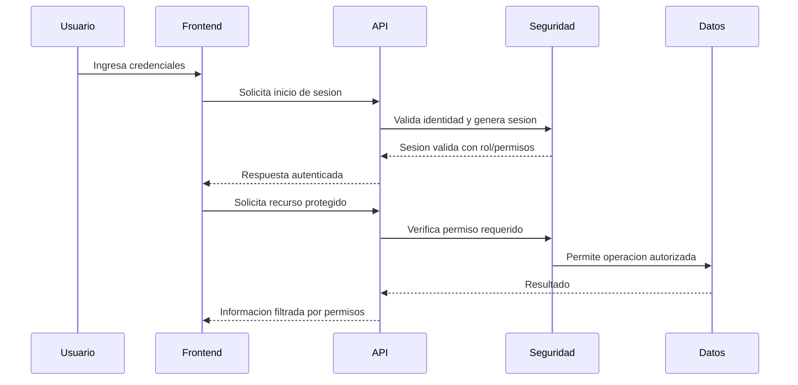
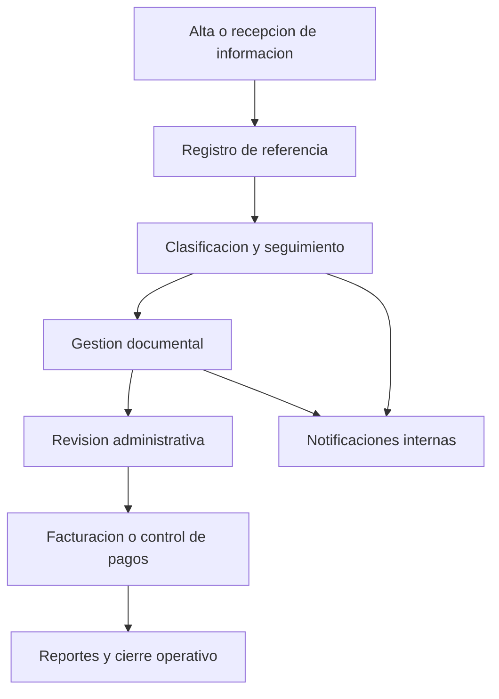
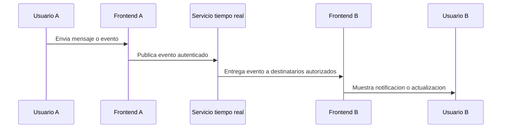
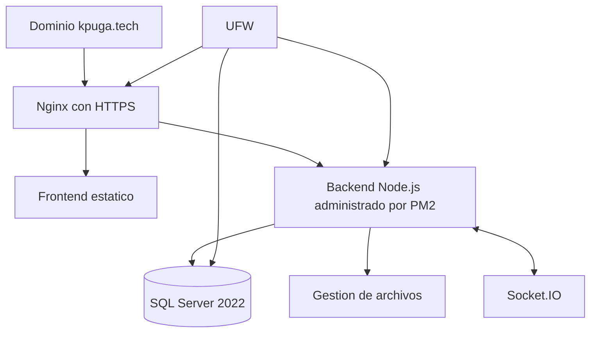

# Diagramas sanitizados

Los siguientes diagramas son abstractos. No representan endpoints completos, tablas, rutas internas, credenciales ni infraestructura real.

## Arquitectura general

## Autenticación y autorización

## Flujo operativo de expediente/referencia

## Comunicación en tiempo real

## Despliegue productivo

